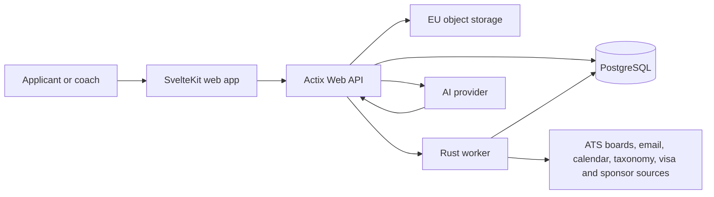

# Architecture Record Document

**Status:** planning baseline

**Last updated:** 2026-09-12

## 1. Architecture decision summary

EU Road will start as a modular monolith: a SvelteKit web application, a Rust/Actix Web API, and a Rust worker in one repository. PostgreSQL is the system of record for transactional data, search metadata, JSON snapshots, vectors, and durable background-job coordination. Object storage holds uploaded and rendered files; it is not a second source of truth.

Production is initially deployed in an EU region. The exact provider and region are intentionally deferred until cost, operations, and data-processing terms are evaluated.

## 2. Quality attributes

| Attribute | Architectural response |
| --- | --- |
| Privacy | Workspace ownership on every private aggregate; server-side authorization; EU hosting; consent ledger; encryption; data minimisation. |
| Correctness | Typed domain commands, database constraints, transactional event writes, immutable submitted artefacts, idempotency keys, and testable rule versions. |
| Explainability | AI and market-fit decisions retain source references, input version, rule version, and confidence. |
| Evolvability | Domain modules, migration-based schema, additive API changes, ADRs, and versioned reference data. |
| Operability | Structured logs, metrics, traces, job visibility, retries, DLQ state, backups, and runbooks. |
| Internationalisation | Locale-aware frontend, canonical machine values, ISO codes, and translation keys separate from user-authored text. |

## 3. System context

External systems are optional integrations. The manual product remains fully usable when every external connector is disabled.

## 4. Logical components

### Web application

SvelteKit renders the authenticated application and public pages. It owns presentation, localisation, client validation, optimistic UI where safe, and a thin typed API client. It never decides authorization or calculates regulated/volatile rules.

### API

Actix Web exposes JSON over HTTPS. It owns authentication, session validation, workspace membership checks, domain commands, data access, API versioning, signed upload/download URLs, and audit emission. Long-running work returns a job/proposal resource rather than keeping a request open.

### Domain modules

The Rust workspace separates code by domain while it remains deployable as one service:

| Module | Responsibility |
| --- | --- |
| `identity` | users, workspaces, memberships, authentication identities, sessions, consent. |
| `profile` | experiences, education, skills, achievements, CVs, public profile. |
| `targeting` | campaigns, target roles/countries, target companies, salary and work preferences. |
| `catalog` | companies, legal entities, taxonomies, skills, credentials, courses, visa routes, postings, sources. |
| `growth` | role requirements, gap assessments, learning plans, progress. |
| `pipeline` | applications, immutable events, interviews, offers, material snapshots. |
| `network` | private contacts, interactions, referrals, follow-up tasks. |
| `insights` | workspace metrics, aggregate eligibility, report generation. |
| `ai` | conversations, proposals, approvals, tool policy, eval traces. |
| `platform` | DB, files, jobs, observability, configuration, rate limits. |

No module queries another module's tables directly outside its repository/service interface. Shared read models are explicit and documented.

### Worker

The worker uses the same Rust workspace and domain commands. It handles ingestion, document rendering, notifications, embeddings, recomputation, export/delete jobs, and AI proposal execution. It claims jobs transactionally with `FOR UPDATE SKIP LOCKED`, records attempts, and uses idempotency keys before external calls.

## 5. Persistence

### PostgreSQL

PostgreSQL owns transactional state. Logical schemas follow domains: `identity`, `profile`, `targeting`, `catalog`, `growth`, `pipeline`, `network`, `insights`, `ai`, and `platform`.

- UUIDv7 is the primary identifier policy, with an application/library fallback until the chosen PostgreSQL version supplies it natively.
- Private tables carry `workspace_id`, have a composite ownership index, and are accessed only after membership authorization.
- `timestamptz` is stored in UTC. A user's IANA timezone is a display/preference value.
- Enumerations that change with business rules are reference tables or constrained text values, not inflexible database enums.
- JSONB is limited to snapshots, provider payloads, translated content, and extensible metadata. Query-critical facts remain normalised columns.
- `pgvector` stores embeddings for semantic matching; it never replaces searchable source text or structured skills.
- PostgreSQL full-text indexes cover user-owned searches and normalised posting text where permitted.

### Object storage

Store original CVs, generated PDFs, exports, avatars, and other binary files in an EU-region object store. PostgreSQL stores a `document_assets` row with owner, content type, byte size, SHA-256, scanner result, lifecycle status, and object key. Access uses short-lived signed URLs after authorization. Files are scanned before becoming available.

### Caches and search

No distributed cache or separate search engine is required in early increments. Introduce either only after measured latency, availability, or scale evidence and record the change in an ADR.

## 6. API and background boundaries

| Work | Execution path |
| --- | --- |
| Profile/application/contact edit | synchronous command in a DB transaction; audit/event row written atomically. |
| Current application stage | projection from accepted pipeline events; cached/materialised only if measurement requires it. |
| CV PDF render or export | durable job; asset status is visible to user. |
| ATS/source ingestion | durable job with source policy, fetch metadata, rate limits, validation, and deduplication. |
| Email/calendar integration | OAuth connection scoped to least privilege; ingest only consented data; durable job. |
| AI recommendation | proposal job; no direct mutation outside the proposal/approval policy. |
| Notification/reminder | durable job with idempotent send record and user preference check. |

## 7. External integrations

Each integration requires a provider adapter and configuration record that declares:

- purpose, owner, allowed markets, expected data categories, and legal/terms review;
- authentication mechanism, scopes, token encryption, rotation and disconnect behaviour;
- rate limit, retry strategy, fetch cadence, freshness signal, and failure mode;
- source attribution, raw-payload retention policy, normalisation version, and monitoring.

Initial integrations are read-only except user-authorised email/calendar ingestion. No connector can submit applications or send messages in the first release.

## 8. Security design

- Authenticated API requests identify a user, then resolve a workspace membership and role before accessing data.
- Google OAuth uses Authorization Code with PKCE, state/nonce validation, verified redirect URIs, and identity linking rules that prevent account takeover.
- Sessions use secure, `HttpOnly`, `SameSite` cookies or equivalent secure tokens, rotation, expiration, and revocation.
- OAuth refresh tokens and integration credentials are envelope-encrypted and never exposed to the frontend or logs.
- Sensitive actions—export, delete, share, integration connect/disconnect, AI proposal execution, public-profile changes—produce audit events.
- CSRF, rate limits, input validation, output encoding, CSP, file scanning, dependency patching, and secrets management are release requirements.

## 9. Observability and operations

- Correlation IDs link web request, API command, background job, integration call, and audit event.
- Logs use structured fields and redact credentials, CV contents, notes, messages, and provider raw payloads.
- Metrics include request latency/error rate, queue age, job retry/failure rate, external-source freshness, upload scan failures, and high-level product funnel events.
- Production needs tested backup/restore, migration rollback/forward plan, incident contact/runbook, and data-deletion verification before public beta.

## 10. Consequences and boundaries

The modular-monolith choice lowers operational cost and keeps cross-domain privacy transactions simple. Boundaries must still be enforced in code so a future extraction is possible. The main risks are a growing PostgreSQL workload and integration complexity; both are addressed by measuring query/job behaviour and isolating adapters before adding infrastructure.
