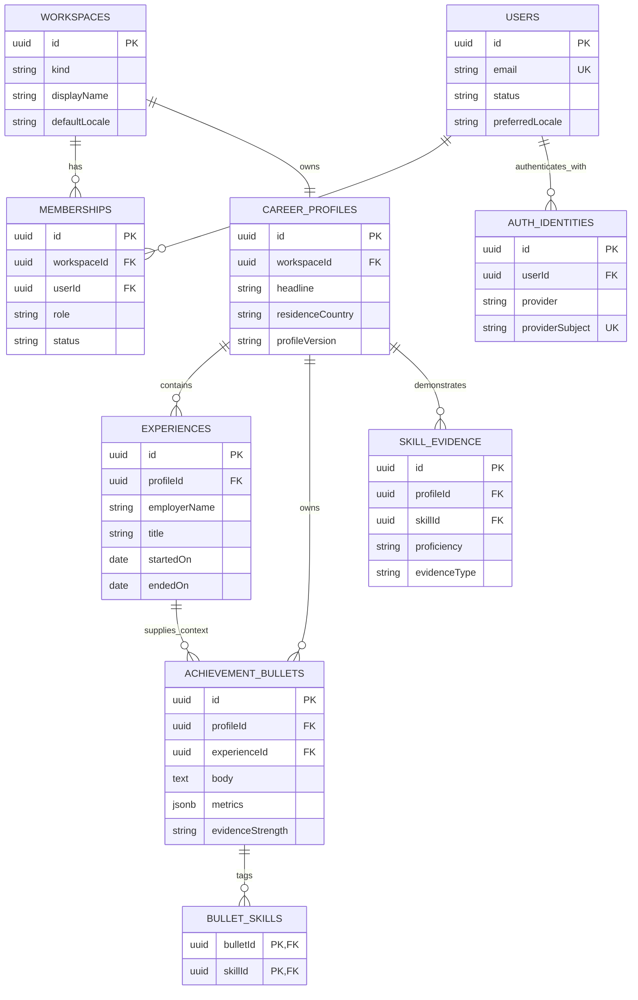
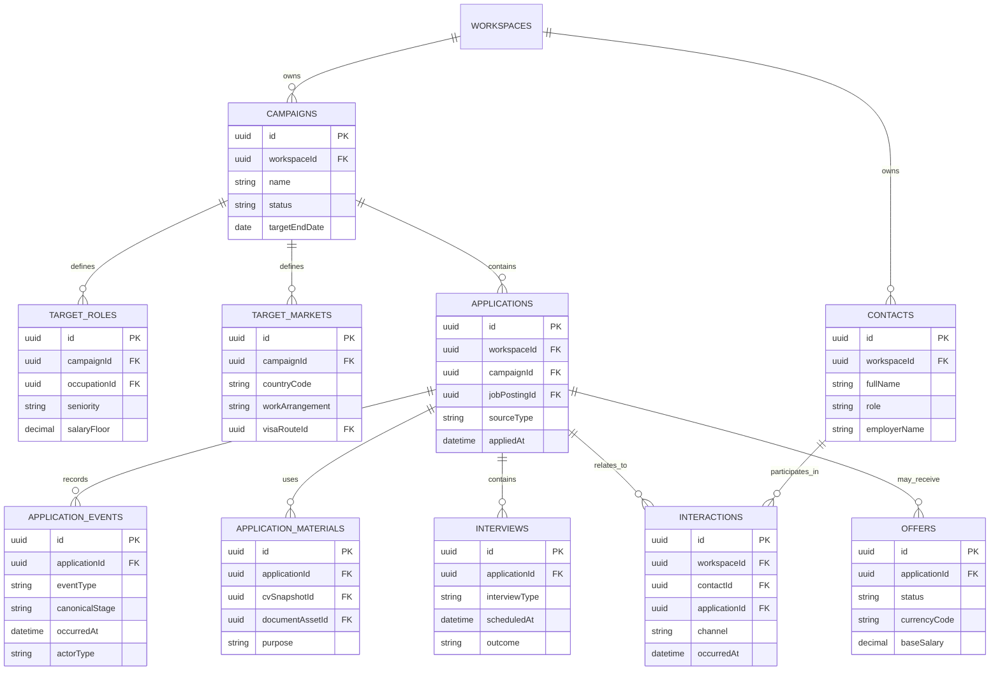
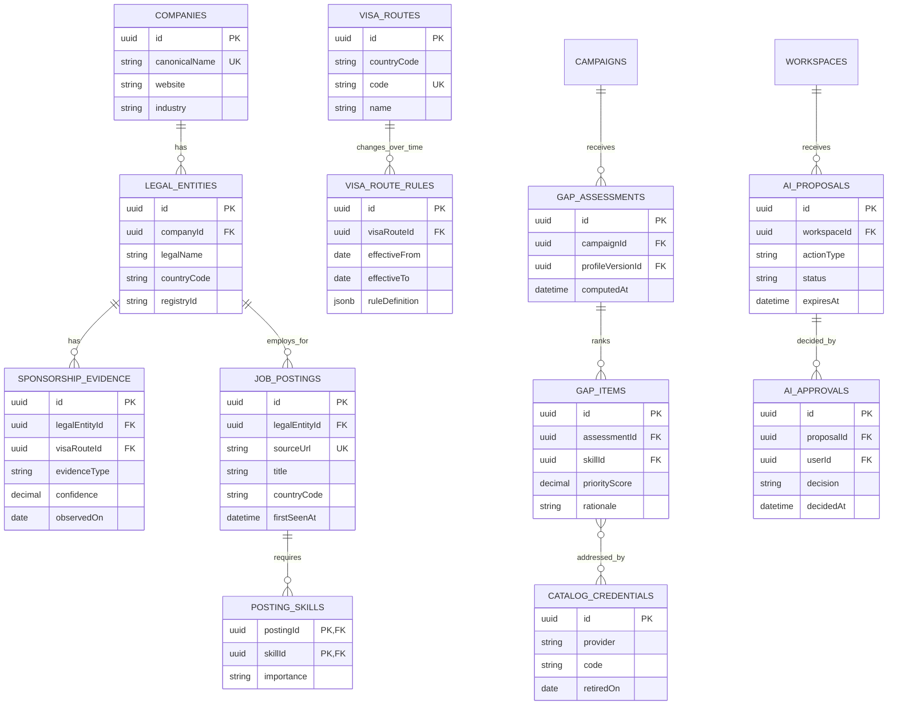

# Logical ERD

This is a logical data model, not executable DDL. It captures ownership and cardinality; the [data dictionary](data-dictionary.md) supplies the full domain inventory and migration conventions. Tables are split by bounded context so they remain readable.

## Modelling conventions

- Private tables have `workspace_id` and must be authorised by workspace membership.
- IDs are UUIDv7 where available. All timestamps are UTC `timestamptz`.
- Every mutable, user-facing aggregate includes `created_at`, `updated_at`, and an actor/source where relevant; these columns are abbreviated in diagrams.
- Content that was submitted, rendered, or used by a recommendation is immutable/versioned.
- ISO 3166-1 alpha-2 country codes, ISO 639/BCP 47 language tags, ISO 4217 currency codes, and IANA time zones are stored as constrained text/reference data.

## Identity and profile

## Targets, applications, and private network

## Shared catalog, growth, and controlled AI

## Key integrity rules

1. A private child row must reference a parent from the same `workspace_id`; enforce this with composite foreign keys or a trigger/check pattern where PostgreSQL cannot express it directly.
2. Applications must reference a campaign in the same workspace. Contacts and interactions cannot cross workspaces.
3. A CV snapshot used by an application is immutable and retains the profile/template/source inputs that produced it.
4. Application events cannot be updated or deleted through normal product commands. Corrections use a superseding event.
5. Sponsor evidence must include a source and observation date; confidence is a bounded value with documented calculation/meaning.
6. Rules and credentials must have effective dates. Recommendations resolve the version applicable at evaluation time.
7. AI proposals store only structured action payloads and references; they do not bypass the command/authorization layer.
